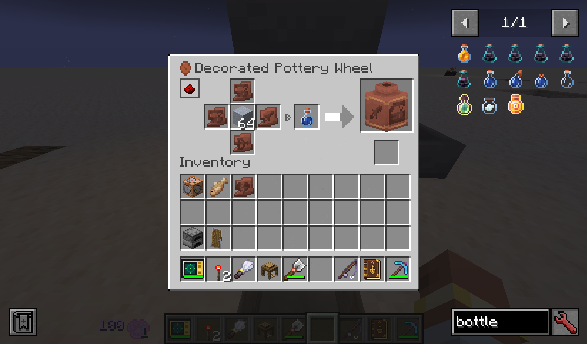
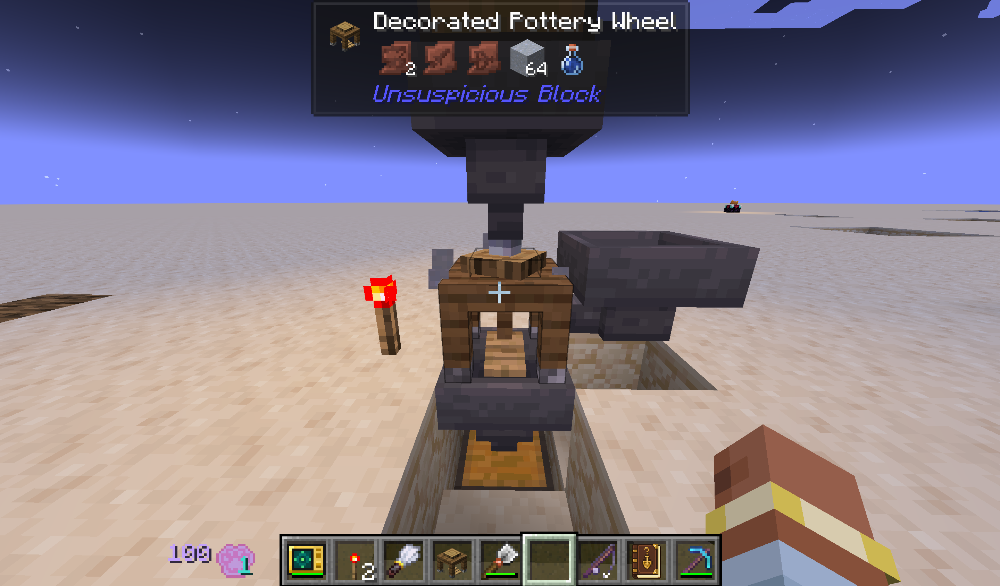

# 更新日志 Change log

## [1.0.0]
添加了可疑扫描仪，实现与jade的联动。

## [1.1.0]

### 新增
- 添加了考古笔记，现在可以记录考古信息了。

## [1.2.0]

### 新增

#### 考古笔记「日志」标签页
- 新增「日志」标签页，完整记录玩家每次考古相关事件

#### 可自定义追踪的战利品表
- 追踪战利品表现支持通过配置文件自定义，支持 `namespace:path` 精确匹配与 `path/`前缀批量匹配。详见配置说明请参考 `README_CN.txt` / `README_EN.txt`（NeoForge 下位于配置注释，Fabric 下位于配置目录）。
- 新增对考古、战利品箱、钓鱼行为的日志支持，玩家可在配置文件中自由添加需要追踪的战利品表。

#### 自动生成翻译键与缺失翻译键导出
- **缺失翻译键自动导出**：运行时检测到考古笔记中存在未本地化的战利品表名时，会自动将缺失翻译键追加写入游戏目录下的 `usb_miss_key/missing_keys.json`，value 预填为战利品表的清洗名称，方便直接修改后合并回模组语言文件。
  - **为配置中新添加的战利品表补全翻译的步骤**：
    1. 在配置文件 `unsuspiciousblock.json` 的 `archaeology_path_prefixes` 中添加目标表规则（如 `mymod:archaeology/`），重载游戏；
    2. 进入游戏世界，触发考古笔记目录加载（打开手册或执行 `/usb debug table_list`）；
    3. 查看 `usb_miss_key/missing_keys.json`，其中已自动列出所有缺失的翻译键及预填名称；
    4. 将该文件中的键值对合并到模组的 en_us.json 与 zh_cn.json，并将 value 修改为正式翻译即可。

#### 新增 4 种附魔
- **化石猎手**（Fossil Hunter）：最高 1 级，适用于镐子。破坏自然生成的骨块时，有 50% 概率额外 roll 一份对应维度的骨块掉落表；玩家放置的骨块不触发此效果。
- **织物采集**（Textile Recovery）：最高 1 级，适用于剪刀。剪羊毛时有 30% 概率额外掉落 1~2 根线。
- **泥地打捞**（Mud Dredging）：最高 3 级，适用于钓鱼竿。在开放水域钓鱼收杆时，每级提供 10% 概率（满级 30%）将原版战利品表替换为自定义沼泽掉落表；若当前群系注册名包含 "swamp"，额外提升 10% 概率。
- **精掘**（Precision Excavation）：最高 3 级，适用于刷子。刷拭可疑方块时，按等级概率（1 级 16% / 2 级 36% / 3 级 60%）使战利品翻倍。

#### 新增 4 种物品
- **考古铲**（Archaeological Shovel）：铁铲等级工具，可一次垂直挖掘 3 格，不会破坏可疑方块及其支撑方块。挖掘沙子时小概率产出古代金币。
- **古代金币**（Ancient Coin）：可在古迹废墟战利品中发现，用于为可疑扫描仪充能。
- **失落书页**（Lost Page）：可在古迹废墟稀有战利品中发现，与基页和书本在锻造台中合成附魔书。
- **基页**（Base Page）：合成材料。

#### 新增一系列调试用的指令
- 本模组指令以 `/usb `开头，均需要op权限。

### 修改

#### 考古笔记
- 战利品概率展示现改为基于 10000 次模拟抽取获得的近似值，首次启动服务端时可能需要数秒进行计算。
- 注意：部分战利品需满足特定条件方可获得，概率显示仅供参考。

#### 可疑扫描仪
- 重制配方与纹理。
- 新增范围模式，默认按 V 键切换扫描范围，潜行时显示扫描范围边界。
- 范围模式下会消耗能量，并可自动消耗背包中的古代金币进行充能。

### Added

#### Archaeology Journal – "Log" Tab
- Added a **"Log"** tab that fully records every archaeology-related event for the player.

#### Customizable Trackable Loot Tables
- Loot table tracking now supports configuration via config file, with `namespace:path` exact matching and `path/` prefix batch matching. For detailed configuration instructions, refer to `README_CN.txt` / `README_EN.txt` (under NeoForge, located in config comments; under Fabric, in the config directory).
- Added logging support for archaeology, loot chests, and fishing. Players can freely add loot tables to track in the config file.

#### Automatic Translation Key Generation & Missing Key Export
- **Auto-export of missing translation keys**: At runtime, when the Archaeology Journal detects unlocalized loot table names, missing keys are automatically appended to `usb_miss_key/missing_keys.json` in the game directory, with the value pre-filled as the cleaned name of the loot table for easy modification and merging back into the mod's language files.
  - **Steps to complete translations for newly added loot tables in the config**:
    1. Add the target table rule (e.g., `mymod:archaeology/`) to `archaeology_path_prefixes` in `unsuspiciousblock.json`, then reload the game.
    2. Enter the game world and trigger the Archaeology Journal catalogue load (open the handbook or run `/usb debug table_list`).
    3. Check `usb_miss_key/missing_keys.json` – all missing translation keys with pre-filled names are listed.
    4. Merge the key-value pairs from that file into the mod's `en_us.json` and `zh_cn.json`, and change the values to the final translations.

#### 4 New Enchantments
- **Fossil Hunter**: Max level 1, applicable to pickaxes. When breaking naturally generated bone blocks, has a 50% chance to additionally roll the bone block drop table for the corresponding dimension. Does not trigger on player-placed bone blocks.
- **Textile Recovery**: Max level 1, applicable to shears. When shearing sheep, has a 30% chance to drop 1–2 extra string.
- **Mud Dredging**: Max level 3, applicable to fishing rods. When reeling in while fishing in open water, each level provides a 10% chance (30% at max level) to replace the vanilla loot table with a custom swamp drop table. If the current biome registry name contains "swamp", the chance is increased by an additional 10%.
- **Precision Excavation**: Max level 3, applicable to brushes. When brushing suspicious blocks, has a per-level chance (Level 1: 16% / Level 2: 36% / Level 3: 60%) to double the loot.

#### 4 New Items
- **Archaeological Shovel**: Iron shovel-tier tool that can dig 3 blocks vertically in one go. Does not destroy suspicious blocks or their supporting blocks. When digging sand, has a small chance to yield Ancient Coins.
- **Ancient Coin**: Can be found in trail ruins loot. Used to recharge the Suspicious Scanner.
- **Lost Page**: Can be found in trail ruins rare loot. Combined with a Base Page and a Book in a smithing table to craft an Enchanted Book.
- **Base Page**: Crafting material.

#### New Debug Commands
- All mod commands are prefixed with `/usb ` and require operator permissions.

### Changed

#### Archaeology Journal
- Loot probability display is now based on approximate values from 10,000 simulated draws. The first startup on the server side may take a few seconds to compute.
- Note: Some loot requires specific conditions to be obtained; the displayed probabilities are for reference only.

#### Suspicious Scanner
- Recipe and texture reworked.
- Added a range mode, default toggle key is V. While sneaking, the scanning range boundary is displayed.
- Range mode consumes energy and can automatically consume Ancient Coins from the inventory for recharging.

## [1.3.0]

### 新增

#### 可疑扫描仪：Shift + 右键空气充能
- 手持可疑扫描仪时，Shift + 右键点击空气可使用背包中的古代金币补充能量，每枚金币恢复 256 点能量。
- 浪费保护机制：当剩余可充能量不足一枚金币的充能值时，首次 Shift + 右键会提示浪费风险；若在 1 秒内再次 Shift + 右键，则强制消耗金币进行充能，以避免误操作导致资源浪费。

#### 古代金币铁砧修复
- 古代金币现可用于铁砧修复带耐久值的物品，每枚金币修复目标物品最大耐久的 25%。
- 使用古代金币进行修复不会累加附魔惩罚。

#### 考古笔记收藏功能与日志备注
- 现支持通过 Shift + 点击收藏战利品表。
- 日志新增备注功能，被备注的日志将不会被自动销毁。

#### 嵌套战利品表追踪
- 现支持嵌套战利品表的追踪，并标注子表来源（仅当子表同时处于追踪状态时生效）。此修复应解决上个版本中钓鱼战利品表无法追踪的问题。

#### 猫之瞳
- 新增物品「猫之瞳」，可在埋藏的宝藏战利品中发现。装备于护符槽或携带在背包中时，激活以下能力：
  - **附魔候选揭示**：在附魔台界面中展示完整的附魔候选列表。
  - **铁砧成本分解**：在铁砧界面中悬停物品时，追加成本分解提示框。
  - **砂轮操作分解**：在砂轮界面中悬停物品时，追加操作预览提示框。

#### 饰品
- 新增与饰品栏的联动支持：NeoForge 端使用 Curios API，Fabric 端使用 Trinkets。

### 变化

#### 附魔调整
- **泥地打捞**：附魔权重从 2 降至 1，以降低其在附魔台中的出现概率；在沼泽群系中触发后，将分流至专属战利品表（奖励更丰厚）。
- **织物采集**：修改为必定掉落 1～3 根线（随机数量）。
- **精准发掘**：概率模型从硬编码数组改为公式计算。各等级概率调整为：1 级 16% → 28%，2 级 36% → 44%，3 级保持 60% 不变，同时移除了等级上限约束。

#### 调试指令统一为子系统分组结构
- 所有调试指令仍以 `/usb` 开头，需要 OP 权限等级 2。现按子系统重构为子树结构，当前已实现 `journal`（考古笔记）子系统。
- **考古笔记 `/usb journal ...`**
  - `clear [table_id]`：清空玩家考古笔记数据。不带参数时清空全部数据；指定 `table_id` 则仅清除该战利品表的数据。
  - `unlock table [table_id]`：解锁考古战利品表。不带参数时解锁全部表；指定 `table_id` 则仅解锁该表。
  - `unlock item [table_id]`：解锁考古物品条目。不带参数时解锁全部表中的所有物品；指定 `table_id` 则仅解锁该表中的全部物品。
  - `reload`：强制清空概率缓存，重新加载并重新模拟所有被追踪的战利品表概率。
  - `list`：列出当前服务端已加载的所有考古战利品表，包含其翻译键、显示名称等信息。

### 修复
- 修复了钓鱼战利品表无法正常追踪的问题。
- 修复了药水类物品无法正常解析的问题。
- 修复了注入古迹废墟的考古战利品无法正常获取的问题。
- 修复了基页配方中误用 `pitcher_pod` 的问题（现已改用 `pitcher_plant`）。

### Added

#### Suspicious Reader: Shift + Right-click Air Charging
- While holding the Suspicious Reader, Shift + right-clicking in air consumes Ancient Coins from your inventory to recharge energy, with each coin restoring 256 energy.
- Waste protection: When the remaining rechargeable energy is less than one coin's worth, the first Shift + right-click warns of potential waste; if Shift + right-click is performed again within 1 second, the coin is forcibly consumed to charge, preventing accidental resource waste.

#### Ancient Coin Anvil Repair
- Ancient Coins can now be used on an anvil to repair items with durability, with each coin restoring 25% of the target item's maximum durability.
- Repairing with Ancient Coins does not accumulate enchantment penalties.

#### Archaeology Journal Collection Feature and Log Annotations
- Shift + clicking now supports collecting loot tables.
- Logs now have an annotation feature; annotated logs will not be automatically destroyed.

#### Nested Loot Table Tracking
- Support for tracking nested loot tables has been added, with sub-table sources now labeled (only effective when the sub-table is also being tracked). This fix should resolve the issue from the previous version where fishing loot tables could not be tracked.

#### Eye Of Cat
- New item "Eye Of Cat", found in buried treasure loot. When equipped in the charm slot or carried in the inventory, activates the following abilities:
  - **Enchantment Candidate Reveal**: Displays the full list of enchantment candidates in the enchantment table interface.
  - **Anvil Cost Breakdown**: Adds a tooltip with a cost breakdown when hovering over items in the anvil interface.
  - **Grindstone Operation Breakdown**: Adds a tooltip with an operation preview when hovering over items in the grindstone interface.

#### Trinket
- Added compatibility with trinket slots: NeoForge uses Curios API, Fabric uses Trinkets Mod.

### Changed

#### Enchantment Adjustments
- **Mud Dredging**: Enchantment weight reduced from 2 to 1 to lower its appearance rate in the enchantment table; when triggered in swamp biomes, it now diverts to a dedicated loot table (with better rewards).
- **Textile Recovery**: Changed to always drop 1–3 string (random quantity).
- **Precision Excavation**: Probability model changed from a hardcoded array to a formula-based calculation. Adjusted probabilities per level: Level 1: 16% → 28%, Level 2: 36% → 44%, Level 3 remains 60%. 

#### Commands Unified into Subsystem Group Structure
- All commands still start with `/usb` and require OP permission level 2. They are now restructured into subtrees per subsystem. Currently, the `journal` (archaeology journal) subsystem is implemented.
- **Archaeology Journal `/usb journal ...`**
  - `clear [table_id]`: Clears the player's archaeology journal data. Without arguments, clears all data; with `table_id`, clears only that loot table's data.
  - `unlock table [table_id]`: Unlocks an archaeology loot table. Without arguments, unlocks all tables; with `table_id`, unlocks only that table.
  - `unlock item [table_id]`: Unlocks archaeology item entries. Without arguments, unlocks all items in all tables; with `table_id`, unlocks all items in that table only.
  - `reload`: Forcefully clears probability caches, reloads and re-simulates probabilities for all tracked loot tables.
  - `list`: Lists all archaeology loot tables currently loaded on the server, including their translation keys, display names, and other info.

### Fixed
- Fixed an issue where fishing loot tables could not be tracked properly.
- Fixed an issue where potion items could not be parsed correctly.
- Fixed an issue where archaeology loot injected into trail ruins could not be obtained properly.
- Fixed a mistake in the base page recipe that used `pitcher_pod` (now correctly uses `pitcher_plant`).

## [1.4.0]

### 新增

#### 标本箱
- 重做标本箱为 5 格便携容器：可右键打开，并可在物品悬浮提示中预览箱内物品；箱内物品在标本箱位于背包或饰品栏时均可生效。
- 标本箱现可作为饰品装备：NeoForge 端支持 Curios，Fabric 端支持 Trinkets，并新增与 Artifacts 的联动。
- 标本箱现有 30% 概率出现在村庄铁匠铺的战利品箱中。

#### 考古笔记与战利品追踪
- 新增战利品表 100% 完成奖励：当一张被追踪的战利品表中全部物品都至少解锁一次时，发放 1 枚古代金币并弹出 Toast 提示。每张表的奖励仅发放一次.
- 新增陶罐战利品与「化石猎手」额外掉落追踪，默认追踪范围加入原版 `pots/` 战利品表。
- 新增 Lootr 联动（**仅 NeoForge 端**）：支持追踪 Lootr 容器和可疑方块、扫描或提取 Lootr 可疑方块，并持久化尚未取走物品的追踪状态。
- 考古笔记现可展示物品的多种获取路径、继承条件和战利品函数效果，并按概率型或运行时条件区分提示；外部模组注入的战利品也会显示来源标记。
- 目录新增按更新时间排序，支持 WASD、方向键和左右键导航；现在未解锁的物品也可查看获取条件。

#### 配置与扫描
- Fabric 与 NeoForge 两端均新增图形化配置界面；Fabric 端同时支持通过 Mod Menu 打开并热更新配置。
- 可疑扫描仪的范围模式现可检测带战利品表的容器，并用紫色描边与可疑方块区分。

### 变化
- 重构「泥地打捞」的触发方式并调整沼泽战利品表奖励，现在是额外发放而不是替换原有战利品了。
- 调整「化石猎手」的主世界与下界骨块战利品表，重新分配掉落池并加入 Artifacts 饰品。

### 修复
- 修复 fabric 端世界生成卡死的bug
- 修正「Completionist's Dust」成就判定范围，现在仅要求原版 6 张考古战利品表（`minecraft:archaeology/` 前缀）的全物品解锁。
- 修复「泥地打捞」条件注册与钓鱼玩家识别错误导致效果无法正常触发的问题，并补全其嵌套战利品追踪。
- 修复考古铲与可疑扫描仪分持主副手时的交互优先级，使未扫描方块优先扫描、已扫描方块优先提取战利品。
- 修复考古笔记目录哈希、客户端同步和模拟期间追踪回退问题，避免旧缓存覆盖服务端记录、数据包重载残留任务或目录尚未模拟完成时漏记战利品。
- 修复考古笔记在界面缩放时的文字裁切，以及重建搜索框时可能发生的递归响应问题。
- 禁止标本箱嵌套自身，避免递归容器导致物品无法取出。

### Added

#### Specimen Box
- Reworked the Specimen Box into a 5-slot portable container: right-click to open, with item preview in the tooltip. Items inside the box take effect when it is in the backpack or a trinket slot.
- The Specimen Box can now be equipped as a trinket: NeoForge uses Curios, Fabric uses Trinkets, with added Artifacts integration.
- The Specimen Box now has a 30% chance to appear in village weaponsmith loot chests.

#### Archaeology Journal & Loot Tracking
- Added 100% completion reward: when all items in a tracked loot table have been unlocked at least once, the player receives 1 Ancient Coin and a Toast notification. Each table's reward is granted only once.
- Added decorated pot loot and "Fossil Hunter" bonus drop tracking; vanilla `pots/` loot tables are now tracked by default.
- Added Lootr integration (**Only in Neoforge**): supports tracking Lootr containers and suspicious blocks, scanning/extracting Lootr suspicious blocks, and persisting tracking state for items not yet taken.
- The Archaeology Journal now displays multiple acquisition paths, inheritance conditions, and loot function effects for items, with hints differentiated by probability-based or runtime conditions. Loot injected by external mods is also marked with source labels.
- The catalogue now supports sorting by last update time, with WASD, arrow key, and left/right key navigation. Unlocked items can now be previewed for their acquisition conditions before being discovered.

#### Configuration & Scanning
- Both Fabric and NeoForge now have graphical config screens; Fabric also supports opening and hot-reloading config via Mod Menu.
- The Suspicious Reader's range mode now detects containers with loot tables, highlighted with a purple outline to distinguish them from suspicious blocks.

### Changed
- Refactored "Mud Dredging" trigger logic and adjusted swamp loot table rewards — it now grants bonus loot instead of replacing the original loot.
- Adjusted "Fossil Hunter" Overworld and Nether bone block loot tables, redistributed drop pools, and added Artifacts trinkets.

### Fixed
- Fixed a world generation freeze on the Fabric side.
- Corrected the "Completionist's Dust" advancement criteria: now only requires full item unlock for the 6 vanilla archaeology loot tables (`minecraft:archaeology/` prefix).
- Fixed "Mud Dredging" condition registration and fisher player identification errors that prevented the effect from triggering, and completed its nested loot tracking.
- Fixed interaction priority when the Archaeological Shovel and Suspicious Reader are held in main/off-hand: unscanned blocks are now scanned first, and scanned blocks are looted first.
- Fixed Archaeology Journal catalogue hash issues, client sync, and simulation-period tracking rollback — prevents stale cache from overwriting server records, leftover tasks after datapack reload, and missed loot during catalogue simulation.
- Fixed Archaeology Journal text clipping at UI scaling, and a potential recursive response issue when rebuilding the search box.
- Prevented the Specimen Box from nesting itself, avoiding recursive containers that make items unretrievable.

## [1.4.1-bug_fix]

### 修复
- 修复 NeoForge 端 Lootr 联动因 Mixin 注入目标不匹配而在打开战利品容器时崩溃的问题。
- 修复 Lootr 与普通容器的日志物品记录和考古笔记统计使用不同签名，导致“已发现”和“已获得”状态不更新的问题；旧存档中的无歧义记录会在登录时自动迁移。
- 修复考古笔记按时间排序选项不生效的问题。

### Fixed
- Fixed a NeoForge Lootr integration crash caused by a mismatched Mixin injection target when opening loot containers.
- Fixed Lootr and vanilla containers using different signatures for log entries and Archaeology Journal statistics, which prevented discovered and acquired states from updating. Unambiguous legacy records are migrated automatically on login.
- Fixed the bug where the chronological sorting option for archaeology journal does not work.

## [1.5.0]

### 新增

#### 不可疑方块
- 新增「不可疑的沙子」和「不可疑的沙砾」两种方块。使用考古铲分别与沙子、沙砾合成可获得对应的空方块，再通过无序合成填充单个物品。不可疑方块的材质与可疑方块完全一致，拿去整蛊你的朋友吧！
- 放置后的不可疑方块可用刷子快速破坏，并取回其中封存的物品。
- 不可疑方块无法相互嵌套填充。

#### 纹饰陶轮台
- 新增「纹饰陶轮台」、未烧制的纹饰陶片与未烧制的纹饰陶罐。现在可以复制纹饰陶片了。
- 陶轮台支持漏斗自动化：顶部输入黏土和水瓶，侧面输入纹饰样板及其他材料，底部输出成品和空瓶；加工产物会优先产生在下方漏斗中。

  
  

#### JEI 联动
- 为纹饰陶轮台添加了 JEI 分类支持，可查看陶片压印与陶罐成型的配方。

### 变化

#### 考古笔记
- 目录页面重构为分类首页。
- 战利品表目录支持父子层级展开；子表会显示引用来源和在父表中的出现概率，同时加入了循环引用保护。
- 物品网格中，来自同一物品标签（tag）的内容会折叠为分组入口，并显示该分组的发现进度。
- 药水、附魔、唱片和箭等物品现在会显示更详细的变体信息。

### Added
#### Unsuspicious Block
- Added two new blocks: "Unsuspicious Sand" and "Unsuspicious Gravel". Combine sand or gravel with Archaeology Shovel to craft the empty block, then fill it with a single item via shapeless crafting. The textures of unsuspicious blocks are identical to suspicious blocks — go prank your friends!
- Placed unsuspicious blocks can be quickly broken with a brush, retrieving the stored item inside. 
- Unsuspicious blocks cannot be nested inside one another.

#### Decorated Pottery Wheel
- Added the Decorated Pottery Wheel, unfired decorated pottery sherds, and unfired decorated pots. Decorated pottery sherds can now be duplicated.
- The Pottery Wheel supports hopper automation: input clay and water bottles from the top, decorated patterns and other materials from the side, and output finished products and empty bottles from the bottom. Crafted items will prioritize appearing in a hopper below.

  
  

#### JEI Integration
- Added JEI category support for the Decorated Pottery Wheel, allowing to view recipes for sherd stamping and pot forming.

### Changed
#### Archaeology Journal
- The table of contents page has been reworked into a category home page.
- The loot table catalog now supports expanding parent‑child hierarchies. Child tables display their source reference and probability of appearing in the parent table, and cycle reference protection has been added.
- In the item grid, contents from the same item tag are collapsed into a group entry, showing the discovery progress of that group.
- Potions, enchantments, music discs, arrows, and similar items now display more detailed variant information.

## [1.5.1]

### 新增

> 注意：如果发现升级版本后考古笔记信息异常，可以执行 `/usb journal reload` 刷新缓存
#### 考古笔记
- 日志现在支持删除与批量管理：可以在详情页删除单条日志，也可以在列表中批量删除选中条目、当前战利品表的日志或全部日志。
- 每张战利品表都可以单独设置日志保留上限（仍受服务器上限限制），超出后会自动移除最旧的未备注日志；也可以一键仅保留最近 N 条。带备注的日志始终受到保护。

#### 战利品表追踪管理页面
- 考古笔记旁新增战利品表管理页面，可按目录树浏览，并支持按名称或 ID 搜索。所有玩家均可浏览，权限等级 2 及以上方可修改。
- 可为不同语言设置自定义战利品表名称；编辑非 `en_us` 名称前，需要先填写英文名称。

#### 实体容器开箱追踪
- 箱子矿车等可储物实体现在也会纳入战利品追踪。

### 变化

#### 考古笔记
- 重构日志存储方式，减少大量日志读写造成的卡顿或服务端连接丢失问题；旧存档会自动迁移，无需重置进度。
- 父表物品网格不再把子表战利品全部铺开，而是显示可点击的子表入口及其出现概率，点击即可跳转到对应子表。
- 左页目录改为滚轮与滚动条连续浏览，取代之前的翻页式。
- 战利品概率模拟改为分段执行，启动服务器时分摊计算时间，减少单个游戏刻的卡顿。
- 现在带条件的战利品会显示可选场景中最高的概率数值

#### 战利品追踪配置
- 追踪配置现在按世界分别保存，切换集成服务器存档时不会沿用其他存档的规则；旧配置会在首次加载世界时自动迁移。
- Fabric 的 ModMenu 配置界面拆分为独立页面，分别编辑灵体猫参数和当前世界的战利品追踪设置。

#### 附魔
- “泥底打捞”的触发与奖励规则重新平衡：触发概率为 20% + 每级 10%，沼泽判定改用通用群系标签，沼泽中的奖励更偏向高价值宝物。

### 修复
- 修复重启后部分动态物品的获取来源显示不准确的问题。
- 修复组件数据异常时可能将不同物品误判为同一掉落的问题。

### Added

> Note: If the Archaeology Journal shows incorrect information after upgrading, run `/usb journal reload` to refresh the cache.

#### Archaeology Journal
- Logs now support deletion and bulk management: you can delete a single entry from its detail page, or batch-delete selected entries, all logs of the current loot table, or all logs from the list.
- Each loot table can have its own log retention limit (still capped by the server limit). Once exceeded, the oldest unannotated logs are removed automatically; you can also keep only the newest N entries with one click. Annotated logs are always protected.

#### Loot Table Tracking Management Screen
- A new management page is available beside the Archaeology Journal, supporting tree-style browsing and search by name or ID. Everyone can browse it, while only OP can make changes.
- Custom loot table names can be set per language; an English (`en_us`) name must be filled in before editing names in other languages.

#### Entity Container Loot Tracking
- Chest minecarts and other storage entities are now included in loot tracking.

### Changed

#### Archaeology Journal
- Reworked log storage to reduce stutter or server connection loss caused by heavy log I/O. Existing save data migrates automatically, so no progress reset is required.
- Parent table grids no longer flatten all child-table loot. Instead, they show clickable child-table entries with their appearance probability, which take you to the corresponding child table.
- The left catalogue page now supports continuous scrolling with the mouse wheel and a scrollbar, replacing the previous paginated navigation.
- Loot probability simulation now runs in time-sliced stages, spreading the computation across server startup to reduce single-tick lag.
- Conditional loot now displays the highest probability value among its selectable scenarios.

#### Loot Table Tracking Configuration
- Tracking configuration is now saved per world, so switching integrated-server saves no longer carries over rules from another save. Old configurations migrate automatically the first time a world loads.
- The Fabric ModMenu config screen is split into separate pages for editing Spirit Cat settings and the current world's loot-tracking settings.

#### Enchantments
- "Mud Dredging" trigger and reward rules have been rebalanced: the trigger chance is now 20% + 10% per level, swamp detection now uses a common biome tag, and swamp rewards lean more toward high-value treasure.

### Fixed
- Fixed inaccurate acquisition-source display for some dynamic items after a restart.
- Fixed an issue where malformed component data could misidentify different items as the same drop.
