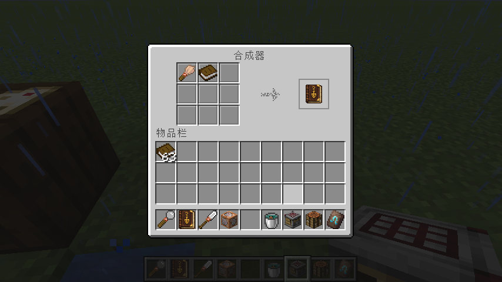
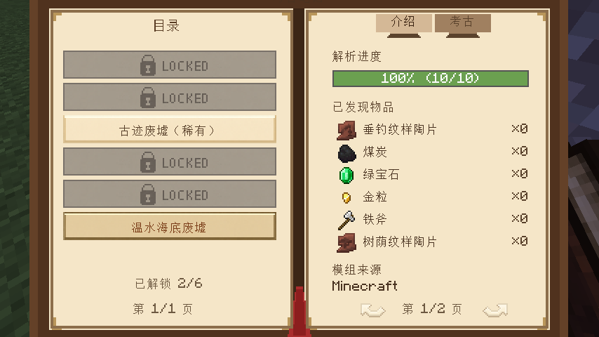
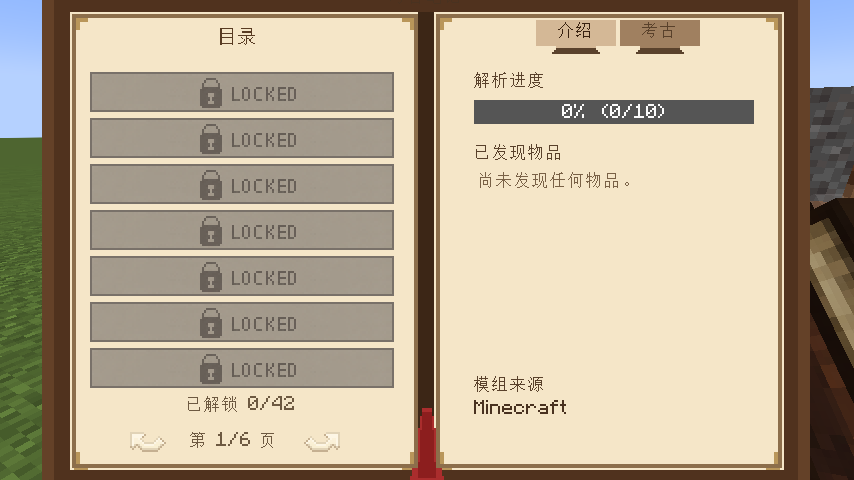

# Unsuspicious Block

**Unsuspicious Block** 是一个 Minecraft 1.21.1 考古增强模组，让你无需漫长刷拭即可快速解析可疑方块中的战利品，并通过 **考古笔记** 记录每一次发掘过程。

> **English version**: [README (English)](docs/readme/README_EN.md)

---

## 特色功能

### 考古笔记

**考古笔记** 是本模组的核心，会自动记录你的所有考古发现。

#### 合成配方

|  |
|:---------------------------------------------------------------------------------------:|
|                                        考古笔记合成配方                                         |

#### 界面展示

考古笔记会自动扫描游戏中的所有考古战利品表，并按结构名称分类展示，同时兼容其他模组新增的战利品表。

|  |  |
|:-------------------------------------------------------------------------------------:|:---------------------------------------------------------------------------------------:|
|                                        战利品表目录                                         |                                          物品详情页                                          |

#### 解锁状态

每次刷拭出新的物品时，考古笔记会自动解锁对应条目并记录下来。

未解锁任何条目时，界面如下：

|  |  |
|:-------------------------------------------------------------------------------------:|:-------------------------------------------------------------------------------------:|
|                                       未解锁任何战利品表                                       |                                        未解锁任何物品                                        |

### 可疑解析仪

**可疑解析仪** 右键任意可疑方块，即可直接揭示其中隐藏的战利品。

|  |
|:-------------------------------------------------------------------------:|
|                                 Jade 联动展示                                 |

- 右键可疑沙子 / 可疑沙砾后，立即显示内部物品
- 自动将结果同步到考古笔记
- 兼容所有继承 `BrushableBlockEntity` 的方块实体，包括其他模组添加的可疑方块
- 配合 Jade 时，可直接在 HUD 中显示扫描后的物品信息

---

## 许可证

本模组采用 **MIT License** 开源。欢迎自由使用。
