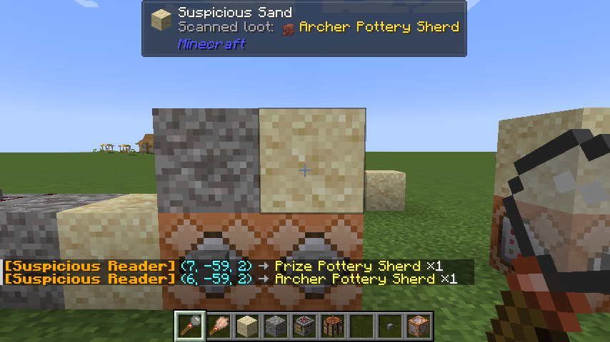
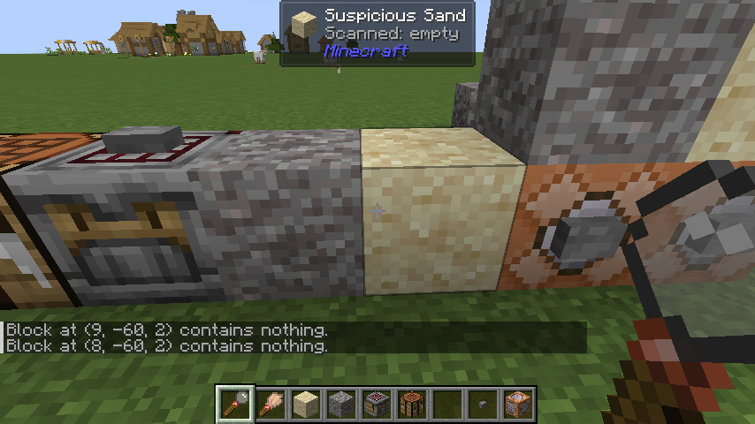

# 可疑方块解析仪 (Unsuspicious Block)

**可疑方块解析仪** 是一个轻量级的 Minecraft NeoForge 模组。  
它添加了一个实用工具 **可疑解析仪 (Suspicious Reader)**，可以让玩家在 **不使用刷子** 的情况下查看 **可疑沙子或可疑沙砾（Brushable Block）** 中隐藏的战利品。

此外，本模组还提供了与 **Jade** 的联动功能，使解析结果能够直接显示在 Jade 的提示框中。

---

## ✨ 功能

### 一键解析
手持 **可疑解析仪**，右键点击一个可疑方块即可解析其中的战利品。

### 即时反馈
解析结果会通过聊天栏显示，包括：

- 战利品物品名称
- 数量
- 方块坐标

示例：[可疑解析仪] (X, Y, Z) → 物品名称 ×数量

### Jade 联动（可选）
如果安装了 **Jade 模组**：

- 当玩家手持解析仪并看向 **已解析过的可疑方块** 时
- 战利品信息会自动显示在 **Jade 提示框** 中
- 注意：在生存模式下，Jade 显示可疑方块详细内容需要将 `<version_file>/config/jade.json` 中的 `builtinCamouflage` 条目修改为 `false`（默认值为 `true`）

---

## 📄 许可证

本项目基于 **MIT License** 开源。

欢迎自由使用、修改和分发本模组。

# [English version]

**Unsuspicious Block** is a lightweight Minecraft NeoForge mod.

It adds a utility tool called the **Suspicious Reader**, which allows players to inspect the hidden loot inside **Suspicious Sand** and **Suspicious Gravel (Brushable Blocks)** without using a brush.

The mod also provides optional integration with **Jade**, allowing scanned loot information to be displayed directly in the Jade tooltip.

---

## ✨ Features

### One-Click Scanning
Hold the **Suspicious Reader** and right-click a suspicious block to scan its hidden loot.

### Instant Feedback
The scanning result will be displayed in the chat, including:

- Item name
- Item count
- Block coordinates

Example: [Suspicious Reader] (X, Y, Z) → Item Name ×Count

### Optional Jade Integration
If **Jade** is installed:

- Looking at a **previously scanned suspicious block**
- The loot information will appear in the **Jade tooltip**
> Note: In survival mode, displaying full block details in Jade requires setting `builtinCamouflage` to `false` in `<version_file>/config/jade.json` (default is `true`).
---

## 📄 License

This project is licensed under the **MIT License**.

You are free to use, modify, and distribute this mod.