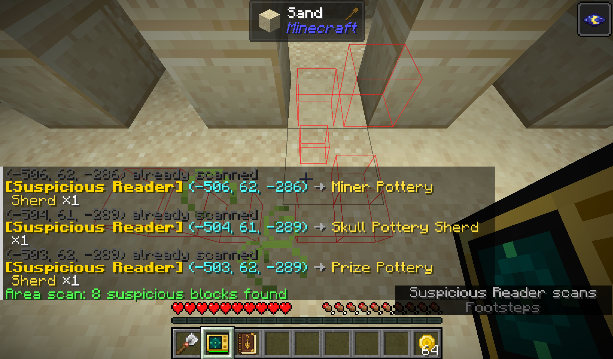

# Unsuspicious Block

**Unsuspicious Block** 是一个围绕考古探索、战利品收集与发现记录展开的 Minecraft 模组。它为可疑方块带来扫描和快速发掘工具，并用一本会随探索逐渐完善的考古笔记，记录战利品、概率、发现地点与每次发掘经历。

> English: [README_EN](docs/readme/README_EN.md)

<!-- SCREENSHOT PLACEHOLDER
文件：docs/image/readme/overview.png
内容：在古迹废墟中手持可疑解析仪，画面同时出现被高亮的可疑方块；快捷栏放置考古笔记与考古铲。
建议：16:9、1920x1080，关闭调试信息，保留 HUD。
替换下方占位文字为：
-->

## 支持环境

| 项目 | 支持情况 |
|---|---|
| Minecraft | 1.21.1 |
| Loader | Fabric 0.17.0+ / NeoForge 21.1.195+ |
| Java | 21 |
| 当前版本 | 1.5.1 |
| 多人游戏 | 客户端与服务端均需安装 |
| License | MIT |

Fabric 版本需要 [Fabric API](https://modrinth.com/mod/fabric-api)。NeoForge 版本没有额外的必需依赖。

## 主要玩法

### 考古笔记

使用一本书和一把刷子即可合成考古笔记。右键笔记，或在背包中携带笔记时按 `C`，即可打开界面。

考古笔记会把探索过程整理成两类信息：

- **目录**：查看已识别的战利品表、可能出现的物品、获取条件和估算概率；支持搜索、排序、收藏，以及隐藏未解锁条目。
- **日志**：记录实际发现的物品、坐标、维度、群系、结构和时间；可以按时间、维度、群系或备注状态分组，为记录添加备注，并复制传送指令。支持删除单条记录、批量删除与单表保留上限设置（带备注的日志始终受保护）。
- **追踪管理**：考古笔记旁的管理页可按目录树浏览与搜索全部战利品表，切换追踪状态并设置多语言自定义名称；箱子矿车等可储物实体同样纳入开箱追踪。
- **收集进度**：刷拭可疑方块、发掘陶罐、钓鱼或触发模组附魔战利品时，对应条目会逐步解锁，并推动一组考古挑战进度。
- **数据包兼容**：默认识别常见的 `archaeology/`、`archeology/`、钓鱼、陶罐及模组化石战利品表；整合包作者还可以通过配置扩展匹配规则。

<!-- SCREENSHOT PLACEHOLDER
文件：docs/image/readme/journal_catalog.png
内容：考古笔记目录页，展示多个已解锁和未解锁的战利品表，并展开一个含概率与条件的物品详情。
建议：16:9 或紧凑裁剪，界面缩放设为 2。
替换下方占位文字为：
-->

> **截图待补：考古笔记目录与物品详情**（目标文件：`docs/image/readme/journal_catalog.png`）

<!-- SCREENSHOT PLACEHOLDER
文件：docs/image/readme/journal_log.png
内容：考古笔记日志页，选中一条包含坐标、群系、结构、实际战利品和玩家备注的记录。
建议：16:9 或紧凑裁剪，确保文字清晰。
替换下方占位文字为：
-->

> **截图待补：考古笔记发掘日志**（目标文件：`docs/image/readme/journal_log.png`）

### 可疑解析仪与考古铲

古迹废墟的普通考古战利品池有 5% 概率出现**古代金币**。它可以用于制作和驱动可疑解析仪。

- 可疑解析仪右键可疑方块后，会直接显示其内部战利品，但不会立即取出物品。
- 按 `V` 可在单方块、`3x3x3`、`5x5x5` 和 `7x7x7` 四种扫描模式间切换。
- 单方块扫描免费；范围扫描消耗能量，并会高亮范围内的可疑方块和尚未开启的战利品容器。
- 解析仪最多储存 512 点能量；潜行并右键空气可消耗一枚古代金币补充 256 点能量。
- 用考古铲右键已经扫描过的可疑方块，可以直接取出战利品，无需等待完整刷拭过程。
- 考古铲会向下连续挖掘最多 3 格铲类方块；潜行时恢复为单格挖掘，并会避开可疑方块及其支撑方块。

考古铲还有 0.3% 概率在挖掘沙子、红沙或砂砾时找到古代金币。古代金币也能在铁砧中修复任意可损坏物品，每枚恢复其最大耐久的 25%；流浪商人还可能提供用 1 枚古代金币兑换 5 枚绿宝石的交易。

<!-- SCREENSHOT PLACEHOLDER
文件：docs/image/readme/suspicious_reader.png
内容：范围扫描后的遗迹场景，清楚显示方块描边、聊天栏扫描结果和解析仪能量条；副手可持考古铲。
建议：16:9、1920x1080。
替换下方占位文字为：
-->

> **截图待补：可疑解析仪范围扫描与考古铲组合使用**（目标文件：`docs/image/readme/suspicious_reader.png`）

### 失落书页与四种附魔

古迹废墟的稀有考古战利品池有 8% 概率出现**失落书页**。将 3 株瓶子草合成为 3 张基页，再在锻造台中依次放入基页、书和失落书页，可以得到一本随机附魔书。结果可能包含本模组附魔、原版附魔，或两者的组合。

| 附魔 | 适用物品 | 效果 |
|---|---|---|
| 泥底打捞 I-III | 钓鱼竿 | 钓鱼时有基础 20% 概率打捞额外宝物，每级提高 10%；在沼泽群系中改为抽取更偏向高价值宝物的沼泽子表 |
| 织物采集 | 剪刀 | 剪羊毛时额外掉落 1-3 根线 |
| 精准发掘 I-III | 刷子 | 刷拭可疑方块时有 28% / 44% / 60% 概率使战利品翻倍 |
| 化石猎手 | 镐 | 挖掘自然生成的骨块时有 50% 概率从当前维度的化石战利品表中获得额外奖励 |

`化石猎手` 只对世界生成时记录的自然骨块生效，玩家或机器放置的骨块不会触发奖励。

<!-- SCREENSHOT PLACEHOLDER
文件：docs/image/readme/enchantments.png
内容：锻造台中的失落书页配方，以及四本带有本模组附魔的附魔书并排展示；可拼成一张图。
建议：横向拼图，文字与附魔名称清晰可读。
替换下方占位文字为：
-->

> **截图待补：失落书页锻造与四种附魔**（目标文件：`docs/image/readme/enchantments.png`）

### 猫之瞳

每个埋藏的宝藏中都会出现一枚猫之瞳。把它放在背包、饰品栏或标本箱中，即可获得三项信息能力：

- 在附魔台中查看每个选项的完整附魔候选，而不只是原版显示的一条提示。
- 在铁砧结果上查看等级成本、附魔、修复、重命名、不兼容惩罚和累积惩罚的分解。
- 在砂轮结果上预览将被移除的附魔、保留的诅咒和返还的经验范围。

<!-- SCREENSHOT PLACEHOLDER
文件：docs/image/readme/eye_of_cat.png
内容：持有猫之瞳时的附魔台完整候选 tooltip，并附带铁砧或砂轮成本分解的小图。
建议：横向拼图，突出 tooltip 变化。
替换下方占位文字为：
-->

> **截图待补：猫之瞳的附魔台、铁砧与砂轮信息**（目标文件：`docs/image/readme/eye_of_cat.png`）

### 标本箱

村庄武器匠房屋的箱子有 30% 概率出现标本箱。它是一个拥有 5 格空间的便携容器：右键打开，悬停时可以预览内容，放在背包或饰品栏中时，箱内需要“随身携带”或“装备”才能生效的物品仍可正常工作。

安装 Trinkets（Fabric）或 Curios（NeoForge）后，标本箱可以装备到饰品栏，并代理箱内兼容饰品的属性与效果。它也包含对 Artifacts 饰品的可选适配。

<!-- SCREENSHOT PLACEHOLDER
文件：docs/image/readme/specimen_box.png
内容：标本箱的 5 格 GUI，内部放入考古笔记、猫之瞳和若干兼容饰品；同时展示物品栏中的内容预览 tooltip。
建议：紧凑裁剪，确保槽位和 tooltip 清晰。
替换下方占位文字为：
-->

> **截图待补：标本箱 GUI 与内容预览**（目标文件：`docs/image/readme/specimen_box.png`）

### 不可疑方块

模组的同名娱乐方块。用考古铲分别与沙子、沙砾合成，可以获得对应的**不可疑的沙子/沙砾**空方块，再通过无序合成将单个物品封存进去。

- 不可疑方块的材质与可疑方块完全一致--拿去整蛊你的朋友吧。
- 放置后的不可疑方块可用刷子快速破坏，取回其中封存的物品。
- 不可疑方块无法相互嵌套填充。

### 纹饰陶轮台

新增**纹饰陶轮台**、未烧制的纹饰陶片与未烧制的纹饰陶罐，现在可以复制纹饰陶片了。

- 陶轮台支持漏斗自动化：顶部输入黏土和水瓶，侧面输入纹饰样板及其他材料，底部输出成品和空瓶。
- 加工产物会优先产生在下方的漏斗中。

## 推荐上手顺序

1. 用书和刷子合成考古笔记，并把它带在身上。
2. 寻找古迹废墟，通过刷拭获取第一批古代金币和失落书页。
3. 制作可疑解析仪与考古铲，用单方块扫描确认战利品，再直接取出；资源充足后改用范围扫描寻找目标。
4. 用失落书页锻造附魔书，逐步获得精准发掘、化石猎手、织物采集或泥底打捞。
5. 按考古笔记中的目录、日志和挑战继续收集陶片、锻造模板与其它稀有战利品。
6. 寻找埋藏的宝藏与村庄武器匠房屋，取得猫之瞳和标本箱。

建议搭配 JEI、REI 或 EMI 查看配方。本模组本身不强制依赖配方查看器。

## 可选联动

| Mod | 联动内容 |
|---|---|
| JEI | 内置 JEI 插件（含陶轮台配方分类） |
| Jade | 在方块信息中显示已经扫描出的可疑方块战利品 |
| Trinkets | Fabric 饰品栏支持；可装备考古笔记、猫之瞳和标本箱 |
| Curios | NeoForge 饰品栏支持；可装备考古笔记、猫之瞳和标本箱 |
| Artifacts | 标本箱可代理兼容饰品的装备效果 |
| Mod Menu | Fabric 配置界面入口（灵体猫参数与当前世界战利品追踪设置分页编辑） |
| Lootr | NeoForge 构建提供可选兼容，保留每位玩家独立的发掘与日志状态 |

## 配置

- 灵体猫全局配置：Fabric 在 `config/unsuspiciousblock/unsuspiciousblock.json`，NeoForge 使用模组配置界面；安装 Mod Menu 后可从模组列表进入分页配置界面。
- 战利品追踪配置按世界分别保存（Fabric 在世界 `serverconfig/`，NeoForge 由服务端配置管理），切换存档时不会沿用其他世界的规则。
- 单张战利品表的日志保留上限在游戏内日志保留界面设置，仍受服务器上限约束；考古战利品表匹配规则与追踪超时在配置文件中调整。

## 链接

- [CurseForge](https://www.curseforge.com/minecraft/mc-mods/unsuspicious-block)
- [源代码](https://github.com/meteoritel/unsuspicious-block)
- [问题反馈](https://github.com/meteoritel/unsuspicious-block/issues)
- [MIT License](LICENSE.txt)
