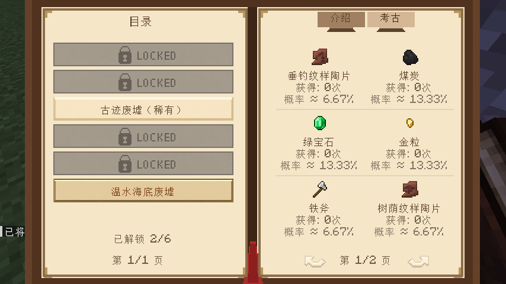
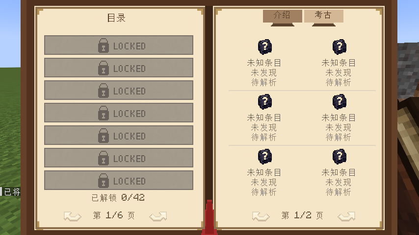
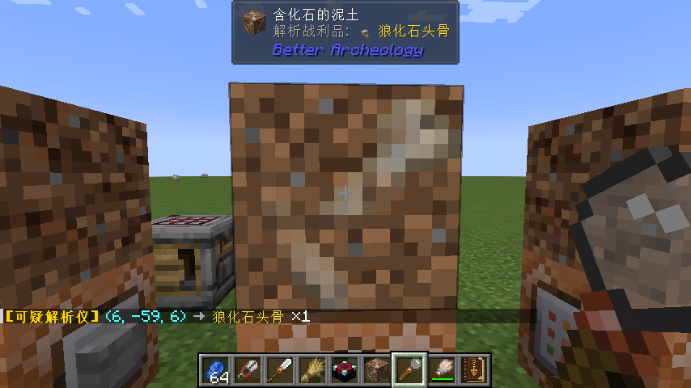

# Unsuspicious Block

**Unsuspicious Block** 是一个 Minecraft 考古系统增强模组，让你无需漫长刷拭即可解析可疑方块中的战利品，并通过**考古笔记**记录每一次发掘旅程。

> **English version**: [README (English)](./doc/readme/README_EN.md)

---

## 特色功能

### 考古笔记

**考古笔记**是本模组的核心，一本自动记录你所有考古发现的随身手册，合成配方如下：

考古笔记自动扫描游戏内所有考古战利品表，并以结构名称分类展示，自适应其他模组添加的战利品表：

点击左侧任意战利品表，右侧展示该结构可能掉落的全部物品：

每次刷拭出新的物品时，考古笔记会自动解锁该物品条目并记录。未解锁任何条目的状态如下：

### 可疑解析仪

**可疑解析仪**右键任意可疑方块即可揭示其中隐藏的战利品

- 右键点击可疑沙子/可疑沙砾，立即显示内部物品
- 自动将结果同步到考古笔记
- 兼容所有继承 `BrushableBlockEntity` 的方块实体（包括其他模组添加的可疑方块）
- 与jade联动可直接显示扫描后的物品信息

---

## 可选联动

| 模组                                        | 功能                      |
|-------------------------------------------|-------------------------|
| **[Jade](https://modrinth.com/mod/jade)** | 在 Jade HUD 悬浮框中直接显示解析结果 |

---

## 许可证

本模组采用 **MIT License** 开源。欢迎自由在整合包中使用！

